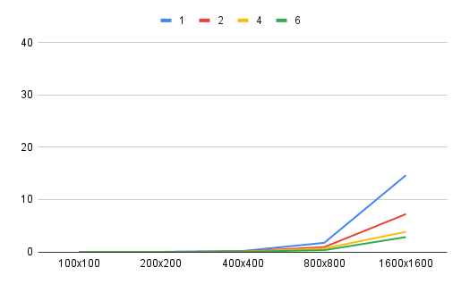

# Matrix Multiplication

## Usage

### Row-wise

```console
 mpicxx main-row-wise.cpp -o main-row-wise && mpiexec -n <num of threads> main-row-wise
```

### Column-wise

```console
 mpicxx main-col-wise.cpp -o main-col-wise && mpiexec -n <num of threads> main-col-wise
```

## Test results

### System specs

- Intel(R) Core(TM) i5-9400 CPU @ 2.90GHz 2.90 GHz (6 cores, 6 threads)
- mpicxx compiler 11.3.0

### Comparison table (row-wise)

| Threads\ Size | 100x100 | 200x200 | 400x400 | 800x800 | 1600x1600 |
| ------------- | ------- | ------- | ------- | ------- | --------- |
| 1             | 0.002s  | 0.023s  | 0.193s  | 2.631s  | 35.263s   |
| 2             | 0.001s  | 0.011s  | 0.121s  | 1.414s  | 17.55s    |
| 4             | 0.001s  | 0.006s  | 0.055s  | 0.789s  | 9.308s    |
| 6             | <0.001s | 0.005s  | 0.05s   | 0.711s  | 7.123s    |


### Comparison table (column-wise)

| Threads\ Size | 100x100 | 200x200 | 400x400 | 800x800 | 1600x1600 |
| ------------- | ------- | ------- | ------- | ------- | --------- |
| 1             | 0.003s  | 0.021s  | 0.175s  | 1.739s  | 14.642s   |
| 2             | 0.001s  | 0.012s  | 0.097s  | 0.926s  | 7.223s    |
| 4             | 0.001s  | 0.005s  | 0.056s  | 0.662s  | 3.837s    |
| 6             | <0.001s | 0.004s  | 0.037s  | 0.344s  | 2.836s    |


