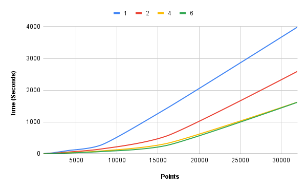

# N-body problem

# Usage

---

### Build & run

```ps
gcc main.c -o main -lm && ./main ./input
```

### Visualize

```ps
py ./visualize.py ./output.csv
```

---

# Program execution visualization

100 bodies, 100 cycles


# Test results

---

## System specs

- Intel(R) Core(TM) i5-9400 CPU @ 2.90GHz 2.90 GHz (6 cores, 6 threads)
- gcc compiler 11.3.0
- 100 iterations

## Comparison table

| Threads\ Bodies | 1000   | 2000    | 4000     | 8000    | 16000    | 32000    |
| --------------- | ------ | ------- | -------- | ------- | -------- | -------- |
| 1               | 8.388s | 27.781s | 130.579s | 272.85s | 1422.11s | 3986.98s |
| 2               | 5.213s | 16.532s | 56.203s  | 151.54s | 557.72s  | 2594.9s  |
| 4               | 4.030s | 10.899s | 32.819s  | 90.13s  | 323.60s  | 1626.5s  |
| 6               | 3.393s | 9.848s  | 27.620s  | 72.02s  | 262.57s  | 1623.2s  |

## Comparison chart


